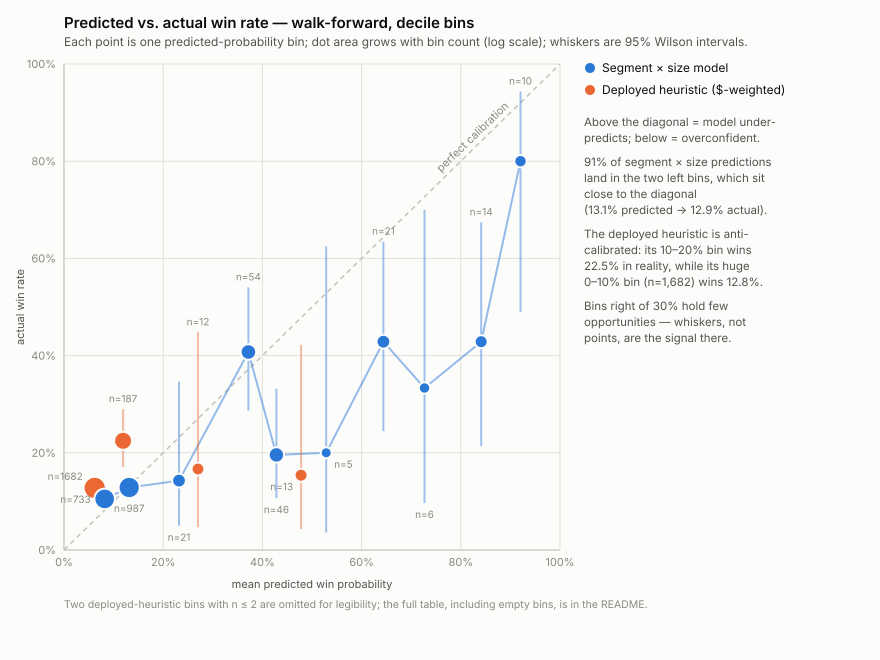
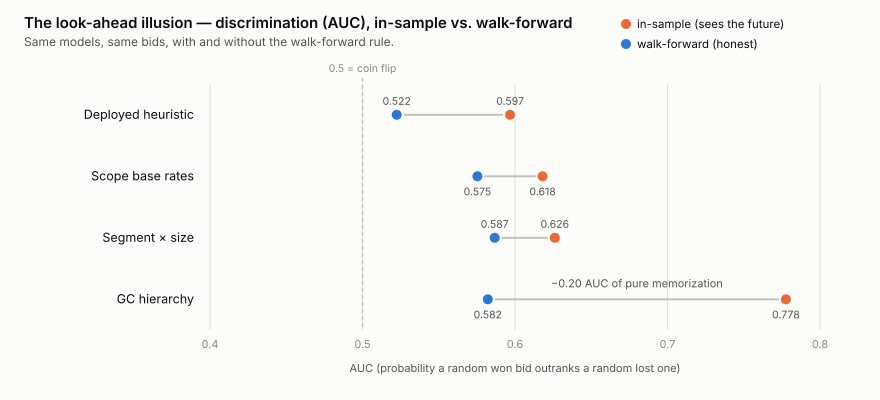
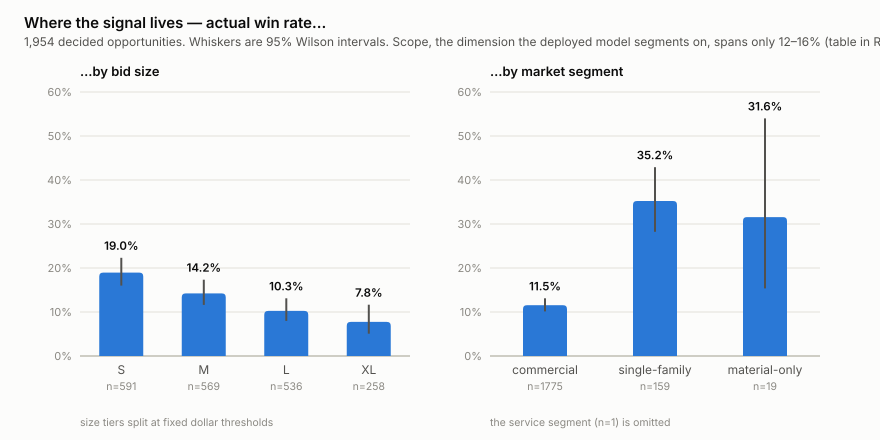

# Can you predict which bids you'll win? A walk-forward backtest

A construction subcontractor prices hundreds of jobs a year and wins roughly one in seven. Every bid gets logged — scope, market segment, size, general contractor, outcome — which raises an obvious question: **can that history produce a calibrated win probability for the next bid?**

The ERP I built and operate for one such company (the system itself is documented in my [construction-erp-case-study](https://github.com/brandongourley/construction-erp-case-study)) ships a "win rate estimator" that answers with segmented historical base rates. This repo is the audit of that idea, done the way a forecasting claim should be audited:

- **Walk-forward, no look-ahead.** Every prediction for a historical bid is computed from *only* the bids that had already resolved before it. The model never sees the outcome it is scoring, nor any outcome that arrived later.
- **Calibration analysis.** Predictions bucketed into deciles; per-bucket actual win rates with 95% intervals; thin buckets flagged rather than averaged away.
- **Proper scoring.** Brier score and log-loss against a naive baseline (the trailing company-wide win rate), plus AUC for discrimination.
- **A deliberate "cheat" run.** The same models scored *with* look-ahead, to measure how much skill an in-sample evaluation would have hallucinated.

The dataset is real (2,194 bid opportunities over ~3.6 years), anonymized to the same standard as the case study: no names, no dollars, no absolute dates. Everything here — dataset, engine, charts — is reproducible from this repo alone.

## Findings up front

1. **The deployed heuristic loses to the naive baseline.** Dollar-weighted, scope-segmented win rates — the shipped logic — score *worse* than a single trailing company-wide rate on every honest metric (Brier 0.1243 vs 0.1204, log-loss 0.4462 vs 0.4067, ECE 0.072 vs 0.031). It is also anti-calibrated where its mass is: the bucket where it predicts 10–20% wins 22.5% in reality; the huge bucket where it predicts ~6% wins 12.8%.
2. **A small fix beats the baseline — modestly.** Count-based (not dollar-weighted) rates over market segment × size bucket, with Laplace smoothing and a fallback chain, improve Brier by 2.5% and log-loss by 2.7% over the baseline, with the best discrimination of the panel (AUC 0.587). That is what genuine segmentation value looks like at n≈2,000: single digits, not miracles.
3. **GC-level segmentation is a look-ahead trap.** In-sample, GC cells look like the strongest signal in the data (AUC 0.778, best Brier of the panel). Walk-forward, the AUC collapses to 0.582 and calibration lands *behind* the naive baseline. Roughly −0.20 AUC of the in-sample number was memorization.
4. **The signal that survives is boring and structural.** Win rate falls monotonically with bid size (19.0% → 7.8% from smallest to largest tier) and differs by market segment (single-family 35.2% vs commercial 11.5%). Scope — the dimension the deployed model actually segments on — spans only 12.0–15.8% across product lines and adds almost nothing.
5. **Where the model says >30%, believe half of it.** High-probability predictions come from thin cells and systematically overshoot (e.g. the 40–50% bucket wins 19.6%). Dense low buckets, where 91% of predictions live, are well calibrated (13.1% predicted → 12.9% actual).

## The data

| | |
|---|---|
| Bid opportunities | **2,194** (a job's scope bid to several GCs counts once) |
| Decided (won or lost) | 1,954 — **268 won, win rate 13.7%** |
| Still open at extraction | 240 |
| Window | ~3.6 years (day indices 0–1,310) |
| General contractors | 208 codes across decided opportunities; the top 3 account for ~19% of all volume |
| Product lines (scope) | 4 major + 2 trace |
| Market segments | commercial · single-family · material-only · (service, n=1) |

One row per *opportunity*: the source system records a bid per GC, and the same job scope priced to N general contractors is one opportunity whose outcome is "did anyone award it to us" — matching how the deployed estimator consumes history. Features (segment, scope, size, GC) come from the highest-value member bid, never from the winning one, so features carry no outcome information.

**Anonymization** (same standard as the case study): GC names → opaque sequential codes assigned in random order, so a code's number carries no volume or identity information; dollar amounts → multiplied by an undisclosed constant and rounded to 3 significant figures (the deployed model is dollar-*weighted*, and weights are scale-invariant, so the model reproduces faithfully); size tiers S/M/L/XL split at fixed round-dollar thresholds whose values are withheld; dates → day indices from an undisclosed day zero. Scope names are generic trade terms.

## The models

All models emit a win probability from history available at the cutoff. Empirical cells use Laplace smoothing `(wins+1)/(n+2)` except the deployed heuristic, replicated as shipped. Fallback thresholds (`minN = 5`, burn-in = 50 decided opportunities) were fixed a priori; sensitivity below.

| Model | Definition |
|---|---|
| **Constant 0.5** | uninformed floor |
| **Trailing base rate** | company-wide win rate over all previously decided opportunities — *the baseline to beat* |
| **Deployed heuristic** | faithful replication of the shipped logic: **dollar-weighted** award rate by segment✕scope, *open bids included in the denominator*, fallback to segment, then a 10% constant |
| **Deployed, decided-only** | same, but open bids excluded — isolates that defect |
| **Scope base rates** | count-based segment✕scope → segment → global |
| **GC hierarchy** | GC✕scope (n≥5) → GC (n≥5) → segment✕scope → segment → global |
| **Scope × size** | scope✕size-tier (n≥5) → scope → global |
| **Segment × size** | segment✕size-tier (n≥5) → segment → global |

## Methodology

**The walk-forward rule.** Opportunities are scored in order of their decision day. The training set for a scored opportunity is exactly the opportunities whose decision day is *strictly before* its own — same-day decisions excluded, so batch updates can't leak sideways. Two cutoff conventions are reported: **decision-day** (primary: "what did we know the moment this bid resolved") and **send-day** (conservative: "what did we know the day the bid went out" — strictly less information, and the deployment-realistic frame).

**The decision-date problem — the weakest link, stated plainly.** The source system recorded award dates throughout, but loss dates only after status-change logging shipped late in the window. Result: **14.6% of decided opportunities have a recorded decision day** (recorded award dates have median lag 128 days from send, p90 ≈ 238 — commercial construction decides slowly). The rest are imputed: wins at `send + 128` (the observed median), losses at `send + L` with **L swept over 30/60/90/120/180 days**. Every headline conclusion is checked across that grid. Imputation cannot be fully laundered away — if true loss lags were far longer than any L tested, early training sets would contain outcomes that weren't actually knowable yet — which is why the send-day cutoff (immune to the scored bid's own imputation) is reported alongside, and why model rankings matter more here than third-decimal metric values. This is the analysis's biggest limitation; the sensitivity grid under Robustness is its bound.

**Scoring.** Brier (raw predictions), log-loss (clipped to [0.01, 0.99] — the deployed heuristic emits exact 0s from empty cells), AUC with tie-averaged ranks, ECE over the decile bins, Wilson 95% intervals per bucket. Scoring starts after a 50-decision burn-in (57 early opportunities skipped in the primary protocol; n = 1,897 scored).

## Results — primary protocol (decision-day cutoff, L=90)

| Model | Brier ↓ | vs base | Log-loss ↓ | AUC ↑ | ECE ↓ |
|---|---|---|---|---|---|
| Constant 0.5 | 0.2500 | −108% | 0.6931 | 0.500 | 0.361 |
| **Trailing base rate** | 0.1204 | — | 0.4067 | 0.540 | 0.031 |
| Deployed heuristic | 0.1243 | **−3.2%** | 0.4462 | 0.522 | 0.072 |
| Deployed, decided-only | 0.1234 | −2.5% | 0.4284 | 0.581 | 0.053 |
| Scope base rates | 0.1187 | +1.4% | 0.3989 | 0.575 | 0.026 |
| GC hierarchy | 0.1227 | −1.9% | 0.4111 | 0.582 | 0.056 |
| Scope × size | 0.1185 | +1.6% | 0.3999 | 0.572 | **0.011** |
| **Segment × size** | **0.1174** | **+2.5%** | **0.3958** | **0.587** | 0.026 |

Both deployed variants sit *below* the do-nothing baseline; excluding open bids from the denominator recovers about a quarter of the gap, so most of the damage is the dollar-weighting itself. Because larger bids win less often, dollar-weighting drags every scope's rate toward its largest losses — a capture-rate statistic mislabeled as a win probability. (A footnote on the baseline: even the trailing global rate underpredicts by ~2.5 pts, because the win rate improved over the window — the target drifts.)

### Calibration



Full decile table for the best model (segment × size), walk-forward:

| Predicted | n | Wins | Mean pred | Actual | 95% CI | Read |
|---|---|---|---|---|---|---|
| 0–10% | 733 | 77 | 8.2% | 10.5% | 8.5–12.9% | slight underprediction |
| 10–20% | 987 | 127 | 13.1% | 12.9% | 10.9–15.1% | **well calibrated, 52% of all predictions** |
| 20–30% | 21 | 3 | 23.2% | 14.3% | 5.0–34.6% | thin — noise |
| 30–40% | 54 | 22 | 37.2% | 40.7% | 28.7–54.0% | good, small n |
| 40–50% | 46 | 9 | 42.8% | 19.6% | 10.7–33.2% | **overconfident** |
| 50–60% | 5 | 1 | 52.9% | 20.0% | 3.6–62.4% | thin — noise |
| 60–70% | 21 | 9 | 64.4% | 42.9% | 24.5–63.5% | overconfident |
| 70–80% | 6 | 2 | 72.7% | 33.3% | 9.7–70.0% | thin — noise |
| 80–90% | 14 | 6 | 84.1% | 42.9% | 21.4–67.4% | **overconfident** |
| 90–100% | 10 | 8 | 92.0% | 80.0% | 49.0–94.3% | near-repeat situations |

The pattern above 30% is one-directional: predicted ≫ actual. Those buckets are fed by small cells (a segment×size cell with 6 wins in 9 tries emits 64%), and even walk-forward evaluation doesn't stop a small cell from being lucky *historically* and wrong *prospectively*. More shrinkage at the top is the obvious next iteration. The deployed heuristic's table is the inverse — mass underpredicted, as the chart shows.

### The look-ahead illusion



Evaluated in-sample, the GC hierarchy is the best model on the panel (Brier 0.1002, AUC 0.778) — "we know which GCs like us" feels like the strongest fact in the data, and 67% of its walk-forward predictions do come from GC-level cells. Evaluated honestly, it ranks behind coarser models on calibration and its in-sample Brier advantage overstates its honest self by 18%. Raising the cell threshold helps monotonically (minN 3/5/10 → Brier 0.1274/0.1227/0.1202) but only ever climbs back *toward* the baseline. Most GC codes carry only a handful of decided opportunities, so GC identity is mostly a memorization surface. This chart is the whole argument for walk-forward evaluation in one picture.

### Where the signal lives



Scope, for contrast — the deployed model's segmentation dimension:

| Scope | n | Win rate |
|---|---|---|
| Windows | 896 | 14.0% |
| Mirrors | 592 | 12.0% |
| Shower Doors | 247 | 15.8% |
| Storefront | 214 | 14.5% |

A 4-point spread across product lines vs a 11-point spread across size tiers and a 24-point spread across market segments. The shipped model segments on the flattest dimension available and weights it by dollars, which injects the size signal *backwards* (big losing bids drag their scope's rate down for everyone).

### Robustness

Brier across the loss-lag grid and both cutoffs (baseline / scope / scope×size / segment×size):

| Protocol | Base | Scope | Scope×size | Seg×size |
|---|---|---|---|---|
| decision-day L=30 | 0.1221 | 0.1191 | 0.1194 | 0.1174 |
| decision-day L=60 | 0.1217 | 0.1195 | 0.1193 | 0.1183 |
| decision-day **L=90** | 0.1204 | 0.1187 | 0.1185 | **0.1174** |
| decision-day L=120 | 0.1204 | 0.1186 | 0.1189 | 0.1172 |
| decision-day L=180 | 0.1180 | 0.1167 | 0.1178 | 0.1153 |
| send-day L=30 | 0.1187 | 0.1177 | 0.1162 | 0.1171 |
| send-day L=90 | 0.1191 | 0.1257 | 0.1177 | 0.1280 |
| send-day L=180 | 0.1181 | 0.1303 | 0.1191 | 0.1304 |

(The full grid — every L at both cutoffs, all eight models — is in `results/metrics.json`.)

Honest reading: under the decision-day protocol the ranking is stable at every L — segment×size best, deployed worst (0.1224–0.1255, always below baseline). Under the conservative send-day protocol with large L, *most* segmentation advantages evaporate (training data thins out exactly when cells need it) and only scope×size stays at or near baseline. The size gradient is the one signal that never inverts; the segment split is real but needs history the early window doesn't have. Nobody should read this table and conclude the segmentation is a large effect — the conclusion it supports is narrower: dollar-weighting is reliably harmful, size/segment count-rates are mildly and conditionally helpful, GC cells are not worth their variance at this n.

## What this implies for the product

1. **Count-based rates, decided bids only.** Dollar-weighting and open-bid denominators are both strictly harmful. This is a ~5-line fix in the estimator hook.
2. **Segment on size tier + market segment, not scope.** The UI already collects size; the model ignores it — while the estimator form collects GC, supplier, sector, and city that the deployed model never reads. Closing that honesty gap matters as much as the math.
3. **Shrink the top.** Cap raw cell rates (or add stronger smoothing above ~30%) until a cell has real volume; today a hot streak of 6 wins in 9 tries prints "64%" on screen and reality delivers half that.
4. **Keep logging decision dates.** Status-change timestamps started landing late in the window; a rerun a year from now scores against real resolution days.

## Limitations

- **Outcomes are operationally recorded, not adjudicated.** "Lost" sometimes means "stopped hearing back." Some losses were surely still winnable when marked.
- **Correlated outcomes.** The same project can appear across product lines, and GC awards cluster in time; Wilson intervals treat opportunities as independent, so they are, if anything, too narrow.
- **The high-probability region is thin** (≈6% of predictions above 30%), so statements about overconfidence there rest on small n — flagged bucket-by-bucket above.
- **One company, one trade, one era.** This is an audit of a specific deployed model on its own data, not a claim about bid prediction in general.
- Open bids at extraction (240) are excluded from scoring; if pending bids differ systematically from decided ones, recent-era training sets are mildly censored.

## Reproduce

```
node src/backtest.mjs      # runs the full protocol grid → results/metrics.json + console tables
node src/make_charts.mjs   # renders charts/*.svg from results/metrics.json
```

No dependencies; Node ≥ 18. `data/bids.csv` is the anonymized opportunity-level dataset (2,194 rows, data dictionary in the header comment of `src/backtest.mjs`). The metrics quoted in this README are exactly the contents of `results/metrics.json` as produced by the command above.

---

*Part of a set of case studies on a production construction ERP: [the system itself](https://github.com/brandongourley/construction-erp-case-study).*
